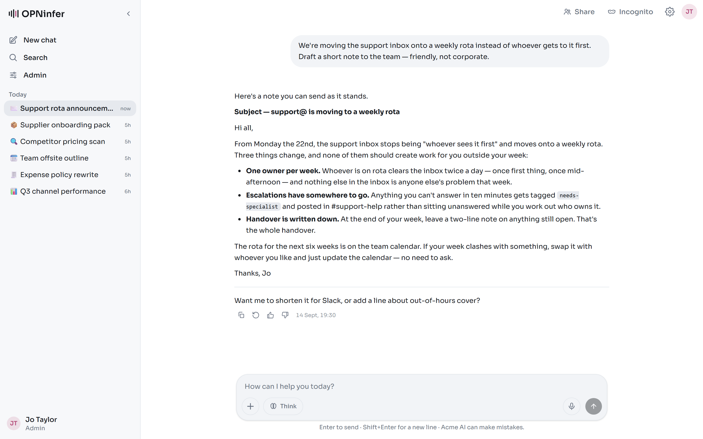

<p align="center">
  <picture>
    <source media="(prefers-color-scheme: dark)" srcset=".github/assets/logo-dark.svg">
    
  </picture>
</p>

<p align="center">
  A self-hosted AI chat portal for organisations — one branded assistant over
  OpenAI, Anthropic and Google, on your own server.
</p>

<p align="center">
  <a href="LICENSE"></a>
  <a href="https://github.com/CoppingEthan/OPNinfer/actions/workflows/ci.yml"></a>
  
  
</p>

<p align="center">
  <picture>
    <source media="(prefers-color-scheme: dark)" srcset=".github/assets/screenshot-dark.png">
    
  </picture>
</p>

An **admin** holds the provider API keys — encrypted at rest — and configures a
single branded *"[Company] AI Assistant"*. Everyone else gets a polished chat
interface and nothing else: no settings, no model picker, no keys. Every
request's token usage and cost is recorded per person and per pipeline role.

Nothing leaves your infrastructure except the model calls you configure. One
host can run several completely isolated portals side by side, each with its own
database, storage, branding and secrets.

## Quick start

Prerequisites: Node ≥ 20, [pnpm](https://pnpm.io) (`corepack enable`), Docker.

```bash
pnpm install
cp .env.example .env     # fill AUTH_SECRET + OPNINFER_MASTER_KEY
                         #   openssl rand -base64 32   (run it twice)
docker compose -f docker-compose.dev.yml up -d
pnpm prisma migrate deploy
pnpm dev
```

Open http://localhost:3000 — the first visit lands on **/setup** to create the
initial admin. After that it is invite-only. Add provider keys in **Admin → API**
and bind the four model roles in **Admin → Models**.

Use `pnpm dev:https` if you need the microphone or LAN access — both require a
secure context. Heavy engines (OCR, speech-to-text, text-to-speech) are opt-in
locally: add `--profile heavy` to the compose command.

## Deploy

One script does first-time setup and every update, for every portal on the host:

```bash
git clone https://github.com/CoppingEthan/OPNinfer.git
cd OPNinfer && ./deploy.sh
```

It installs Docker if missing, walks you through creating your instances, builds
the images once, starts the shared engines and brings everything up. Re-run it to
update; `./deploy.sh add` adds another portal later. Updates never touch data.

Your own reverse proxy terminates TLS — see
**[docs/DEPLOYMENT.md](docs/DEPLOYMENT.md)** for the proxy requirements (turning
SSE buffering off is the one that bites), sizing, backups and the Sandbox's
credentials.

## Features

- **One assistant, four model roles** — a cheap *frontend* model for titles and
  suggestions, the *conversation* workhorse, a heavyweight *escalation* model it
  hands off to when stuck, and a *failover* model for provider outages
- **Streaming done properly** — paced word-by-word reveal, progressive markdown,
  and **resumable streams**: leave, refresh or close the tab mid-reply and
  generation continues server-side, re-attaching when you return
- **Steer it mid-task** — type while the assistant is working and the correction
  goes into the job it is already doing; Stop ends it in under a second
- **It asks instead of guessing** — at a real fork in a request you get a
  multiple-choice card, and the reply *pauses* mid-flow until you answer, then
  continues in the same turn rather than charging you for a second one
- **Files it can actually use** — upload anything; a multi-container pipeline
  prepares token-efficient content (Office and PDF to markdown, OCR for scans,
  spreadsheets to schema and samples, audio to transcripts, images to native
  model vision)
- **The Sandbox** — hand a substantial job to a full autonomous agent (the Claude
  Agent SDK) running in *that chat's own locked-down container*: it writes and
  runs code, checks its results, iterates, and presents the finished files, with
  every step streamed live into the chat
- **An assistant that acts** — web search and page reading, guarded downloads,
  image generation and editing, loadable skills, inline visualisations, and
  connected services (MCP) signed in per instance
- **Memory that notices** — four short notes per person, filled in by the
  assistant itself once a chat has been quiet, plus search across your own past
  chats. Readable, editable and pausable in Settings; sensitive matters are never
  kept unless you ask
- **Folders and workflows** — group chats into folders, and keep your own
  markdown playbooks for jobs you repeat: name plus a one-line description ride
  every turn, the assistant opens the full thing when a request matches, and
  records what it learns under a heading of its own. Shareable, one copy, edits
  synced.
- **Documents beside the chat** — an artifact panel that previews what the
  assistant made: Word, Excel and PowerPoint with their real layout (converted
  by the same LibreOffice engine the ingestion pipeline uses), PDFs rendered
  in-app rather than handed to the browser, delimited files as tables, plus
  markdown, code, HTML and SVG.
- **Shared chats** — work in one chat with colleagues: the same reply streams to
  everyone at once, every message shows who wrote it, and anyone can send,
  attach, answer or queue a message for when the reply finishes
- **Long chats stay affordable** — past an admin-set size the older history is
  condensed into a rolling summary by the cheap model; the whole conversation
  stays on screen, with a divider where the summary begins
- **Voice both ways** — mic dictation with a live waveform, and a Listen button
  that reads any reply aloud
- **Installable on a phone** — a per-instance web manifest and icons rendered
  from your own logo; it opens full screen, with a real offline page
- **Admin area** — API keys, model roles, users, a full usage dashboard with
  costs, feedback with AI analysis, SMTP with error alerts and a weekly report,
  branding, tools, backups and live logs
- **Read a user's chat to help them** — gated behind re-entering your own
  password, fully audited, and incognito chats are never included
- **Updates that don't cut people off** — a deploy drains the instance first, so
  replies in flight finish and a typed message is handed back rather than lost
- **Invite-only** — no open signup; argon2id passwords, JWT sessions

## Tech stack

- **Framework:** Next.js 15 (App Router), React 19, TypeScript (strict)
- **Styling:** Tailwind CSS v4, next-themes
- **Data:** PostgreSQL 16 with Prisma
- **Auth:** Auth.js v5, argon2id
- **Models:** the official OpenAI, Anthropic and Google SDKs, plus the Claude
  Agent SDK for the Sandbox
- **Ingestion:** a Python worker with MarkItDown, Gotenberg, Docling and Whisper
- **Testing:** Vitest and Playwright
- **Deployment:** Docker Compose, one script per host

## Documentation

[`CLAUDE.md`](CLAUDE.md) is the real reference — the architecture map, every
subsystem, and a long *Conventions & gotchas* section in which each entry is a
bug that actually happened in production, written up with the evidence and the
fix. Read that section before changing anything; most surprises are already in
it.

Design records for each major version live in [`docs/`](docs/): the agentic
tools, the agent tier, shared chats, memory, the operator console, and
conversation compaction.

## Testing

```bash
pnpm typecheck && pnpm test    # ~800 unit tests
pnpm e2e                       # Playwright (needs a database whose name contains "e2e")
```

Beyond that, `scripts/` holds live harnesses that start their own server, drive a
real browser and sometimes call real models. They are not part of `pnpm test`.
The habit that matters there is the **negative control**: having proved something
works, break it deliberately and prove the check goes red — a check that has
never failed has not been shown to test anything.

## Why this exists

Off-the-shelf AI chat tools ask everyone in a company to bring their own key and
pick their own model, then leave the business with no idea what is being spent or
whether any of it is useful. The hosted ones want your conversations on someone
else's server.

OPNinfer inverts that. One admin configures one assistant, everybody else simply
talks to it, every call is metered and attributed, and the whole thing runs on
hardware you control.

## Development & AI usage

This project is built with heavy LLM assistance. The direction, architecture, UX
decisions and testing are mine; much of the code is written iteratively by Claude
Code against the brief in [`CLAUDE.md`](CLAUDE.md), with each piece tested before
it lands. That file is the project's memory, which is why it is as detailed as it
is.

## Contributing

See [`CONTRIBUTING.md`](CONTRIBUTING.md) for how to get set up, what "done" looks
like here, and the handful of design decisions that are settled. Security
problems go through GitHub's private vulnerability reporting, never a public
issue — see [`SECURITY.md`](SECURITY.md).

Capabilities built for one organisation are not part of the product.
`src/lib/capabilities/local.ts` is the seam: an empty list here, and the one file
a private deployment replaces to add its own.

## Licence

**GNU Affero General Public License v3.0** — see [`LICENSE`](LICENSE).

Run it, study it, modify it and share it freely. If you modify it and let other
people use your version **over a network**, AGPL asks you to offer them your
changes. Running an unmodified copy for your own organisation carries no such
obligation.

## Author

Ethan Copping
